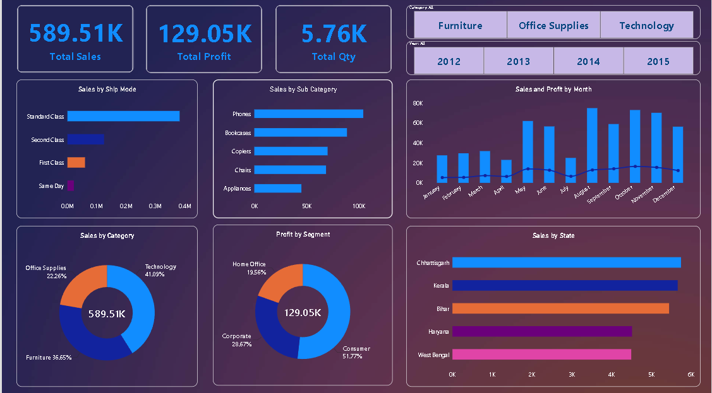

# Superstore Sales & Profit Analysis Dashboard

## 📊 Project Overview
This project is an interactive Data Analytics dashboard created using
Microsoft Power BI.
The dashboard analyzes Superstore sales data to understand sales,
profitability, quantity sold, shipping modes, product sub-categories,
customer segments, categories, monthly performance, and state-level sales.

## 🛠️ Tools & Technologies
- Microsoft Power BI
- Power Query
- DAX
- Microsoft Excel
- Data Visualization
- Data Analysis

## 📌 Key KPIs
The dashboard displays the following key performance indicators:
- Total Sales: 589.51K
- Total Profit: 129.05K
- Total Quantity: 5.76K

## 📈 Dashboard Analysis
The dashboard contains the following visualizations:
### Sales by Ship Mode
Shows sales distribution across:
- Standard Class
- Second Class
- First Class
- Same Day

### Sales by Sub-Category
Compares sales across product sub-categories such as:
- Phones
- Bookcases
- Copiers
- Chairs
- Appliances

### Sales and Profit by Month
Shows monthly sales using bar charts and profit using a line chart,
allowing monthly performance to be compared.

### Sales by Category
Shows the contribution of:
- Technology
- Furniture
- Office Supplies

### Profit by Segment
Shows profit contribution from:
- Consumer
- Corporate
- Home Office

### Sales by State
Compares sales performance across selected states.

## 🎛️ Dashboard Filters
The dashboard includes filters for:
- Category
- Year
- 2012
- 2013
- 2014
- 2015
These filters allow users to interactively explore different parts
of the dataset.

## 🎯 Project Objectives
The main objectives of this project are:
1. Analyze overall sales performance.
2. Understand profitability across customer segments.
3. Identify high-performing product sub-categories.
4. Compare different shipping modes.
5. Analyze monthly sales and profit trends.
6. Compare sales across product categories.
7. Examine state-level sales performance.
8. Present business insights through an interactive dashboard.

## Dashboard Preview



## 📁 Project Structure

```text
powerbi-superstore-sales-dashboard/

## Author
Shailesh Panchal
